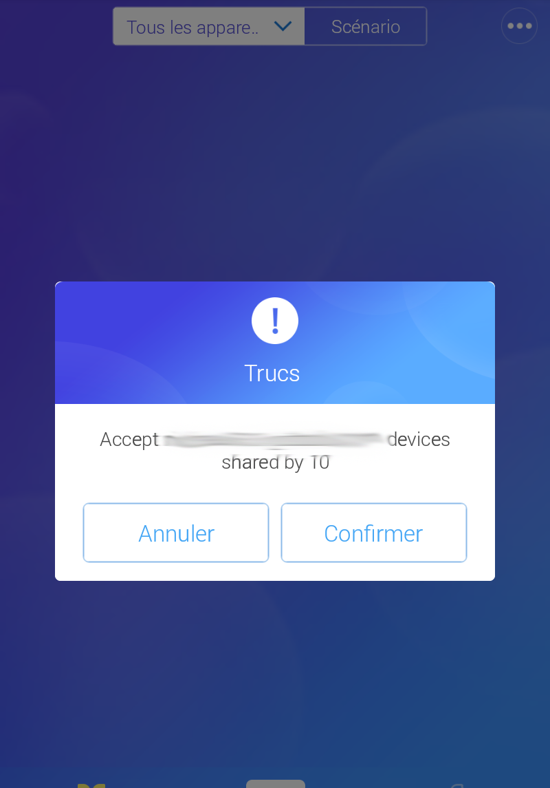
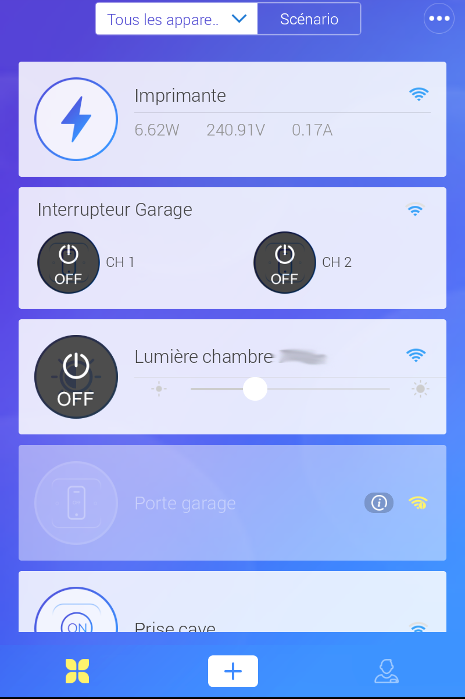
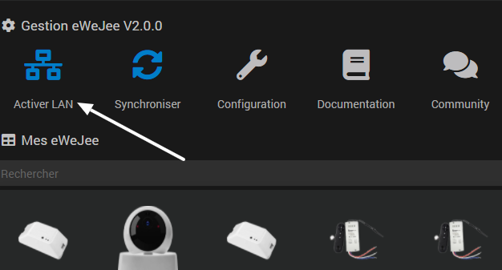
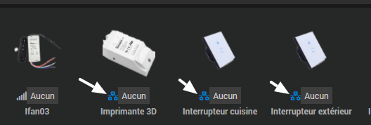
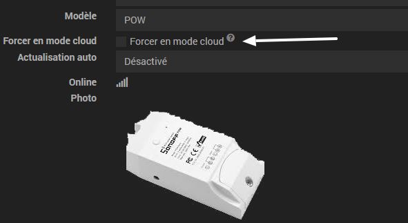
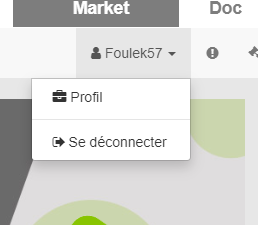
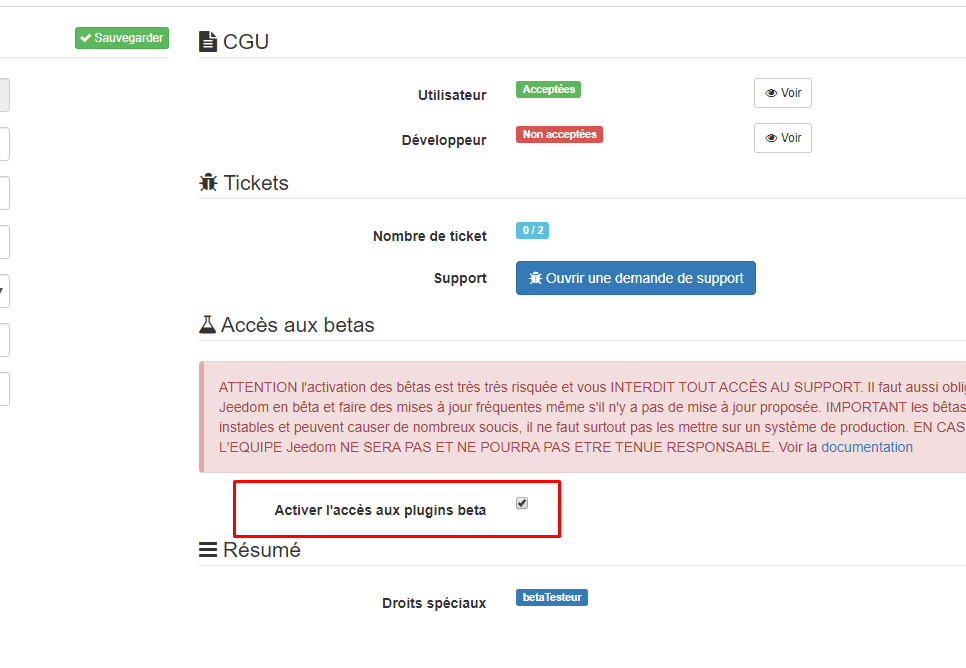

 

eWeJee 
============================== 

 
# Version 2.0 en Bêta, celle-ci ajoute une possibilité de contrôler les équipements en LAN, sans passer par le cloud ! Plus d'info ICI : https://github.com/foulek57/jeedom-ewejee/blob/master/docs/fr_FR/index.md#lan

Je vais ajouter cette possibilité, de telle  sorte que vous n'ayez juste à cliquer sur un bouton sans entrer une seule adresse IP ou autre, afin de se simplifier la vie ;-)

Description
----------- 

 

Ce plugin a pour but d’intégrer à Jeedom TOUT vos équipements compatible eWeLink sans les flasher. 

Beaucoup d’appareils sont compatibles avec eWeLink, notamment ceux de la marque Sonoff, très connue pour les appareils peu coûteux et relativement fiable. 

La liste ne s’arrête pas aux Sonoff, beaucoup de fabriquants Chinois produisent des appareils compatibles avec l'application eWeLink comme par exemple des humidificateurs, bandes led etc… 

Grace à un bouton de synchronisation, un clic et tout vos équipements sont importés dans Jeedom. 

Il faut en amont configurer votre appareil avec l'application eWeLink. Pour cela, reportez-vous à la notice fournie avec votre appareil. 

Le plugin est conçu pour être utilisé sans avoir de connaissances particulières tout est codé pour vous simplifier la mise en place. 

 

**IMPORTANT**
=========

Si vous rencontrez un problème avec le plugin, veuillez créer un nouveau sujet sur <http://community.jeedom.com>
Veuillez donner le maximum de détail et au minimum les logs
Pour savoir comment envoyer des logs sur le community Jeedom, @akenad l’a expliqué dans un de ses “Flash” ici :
<https://community.jeedom.com/t/2440/15>

 

> **Info** 

> 

> Le plugin passe par le cloud eWeLink, mais une fonctionalité LAN (limité à ON/OFF pour le moment) est disponible en Bêta.

 

> **IMPORTANT** 

>  

> eWeLink n'accepte qu'une seule connection par compte, donc dès que vous lancez le plugin, cela va déconnecter votre smartphone et vice versa. 

> Pour palier à cela, il est conseillé de faire un compte eWeLink pour Jeedom, vous pouvez partager vos équipements entre comptes

> eWeLink.
> Cela n'impacte pas le LAN.

Partage d'appareils entre comptes eWeLink
-----------------------------------------

Selectionnez un de vos appareils

Cliquez sur partager

Entrez l'adresse mail du second compte eWeLink puis cliquez sur "Selectionner les devices".

Cochez tous les équipements que vous souhaitez partager et confirmez 
Cliquez ensuite sur OK.

Sur le second apareil où vous avez eWeLink (le second compte), vous recevez une notifiction, acceptez la.

Et voila tous les appareils ont été partagés.

 

 

Configuration 
------------- 

 

Configuration du plugin 
======================== 

 

a.  Installation/Création 

 

> **Tip** 

> 

> Afin d’utiliser le plugin, vous devez le télécharger, l’installer et 

> l’activer comme tout plugin Jeedom. 

 

Suite à cela vous arriverez sur cette page : 

 

 

 

Sur cette page vous devez entrer votre login et mot de passe de l’application eWeLink. 

L'accès interne bloque, est dans le cas où vous avez coupé l'accès interne, si vous n'avez rien fait, laissez sur non.

Etat binaire souhaité, mettez oui si vous voulez que on = 1 et off = 0, pratique pour les widgets.

> **Important** 
> Si vous changez l'état binaire, il faudra supprimer tous les équipements et refaire une synchronisation, sinon il faudra changer tous les types de commandes info.
>
 

N'oubliez pas de sauvgarder !
 

> **Important** 

> 

> Il faut impérativement attendre 5 minutes après avoir lancé l'installation des dépendances, vous pouvez suivre l’installation avec le log ewejee_dep. 

L’installation n'est pas très verbeux, il est donc normal que l'installation reste bloqué quelques instants à 60%. 

 

Si vous avez le message "Echec d'authentification, veuillez vérifier vos identifiants" :  

 

- Le mot de passe ne peut pas contenir de signe "$". 

- Vérifiez vos identifiants, le login doit être l'adresse mail utilisée dans l’application eWeLink. 

- Si vos identifiants sont correct, vérifiez que le démon est bien lancé et que les dépendances sont "OK". 

- Regardez les log "eWeJee_node" dans la section "Logs et surveillance", les dernières lignes vous indiquent l’erreur, si vous ne la comprenez pas, contactez-moi sur community ou GitHub. 

 

Si vous avez une erreur qui vous demande de vérifier le port, vérifiez la configuration dans l’onglet réseau, vérifiez l’accès interne et externe. 

 

Le plugin 
--------- 

 

Rendez-vous dans le menu Plugins &gt; objets connectés pour retrouver le plugin. 

 

 

 

Sur cette page, il vous suffit maintenant de cliquer sur le petit plus au-dessus de synchroniser pour synchroniser tous les équipements de l'application eWeLink. 

 

 

 

Cela fait si vous ne voyez pas les équipements, rechargez la page (CTRL + F5). 

 

 

 

Si vous ajoutez un nouvel appareil, il suffit de relancer le démon, resynchroniser, et l’appareil sera également ajouté au plugin. 

 

Gestion 
========== 

 

Dans la partie gestion vous avez : 

-Synchroniser : Ce bouton sert à synchroniser tous les équipements de l'application eWeLink. 

> **Info** 

>  

>Une détection des équipements déjà connus à été ajoutée, donc plus besoin de tout supprimer. 

>Si vous avez un équipement à actualiser, supprimez-le. 

-Configuration : Pour voir la configuration du plugin… 

 

Mes ewejees 
============= 

 

Affiche tous vos équipements. 

1 ewejee correspond à un équipement (intérrupteur, prise etc…) 

 

Configuration d’un eWeJee 
============= 

 

Vous avez 2 onglets. 

 

Dans l’onglet équipement vous retrouver :  

 

- Le nom de l’équipement. 

- L'objet parent. 

- La catégorie. 

- Une case de commentaire. 

- La marque 

- Le modèle 

- L’état, s’il est en ligne ou non (Information actualisée quand une commande est lancée.) 

- La photo de l’équipement. 

 

 

 

> ** Info** 

> Vous pouvez modifier le nom cela n'a aucun impact. 

> La case de commentaire peut-être utilisée comme vous le souhaitez, cela vous permet de mettre un commentaire à votre équipement. 

 

 

Interrupteur / relais / prises 
=============================== 

Vous avez deux commandes action par « band » (Channel, canal) qui effectue un "on" et un "off" et une commande info qui vous indique s'il est allumé ou éteint. 

La commande info n’est pas binaire. 

 

- La mise à jour se fait automatiquement dès qu'un changement d'état est effectué (même en allumant un interrupteur sans passer par l'appli ou le plugin par exemple) 

- Pour les relais utilisés en "contact sec", l'état de change pas car celui-ci envoi un "push" sur le relais. 

 

> **Info** 

>  

> Il est normal de voir plusieurs channel et états même si votre équipement n'a qu'un channel, car dans la synchronisation  

> on récupère tous les paramètres et sonoff à 4 paramètres, et ceci même pour les équipements qui n'en n'ont qu'un seul. 

> Vous pouvez supprimer ceux qui sont en trop, sauf si le nom est "Ne pas suppr.", dans ce cas cet équipement est obligatoire pour le fonctionnement, vous pouvez décocher la case "Afficher" pour l'enlever du widget. 

 

Commandes  
========= 

 

 

 

- Nom : Le nom de ton équipement (Modifiable). 

- Type : Le type de commande. 

- Options : Permet d'afficher ou de cacher la commande, et d'historiser les commandes info. 

- Unité : Permet de mettre une unité (°C, %...). 

- Action : Accès à la configuration de la commande. 

 

Compatibilité 
------------- 

 

Le plugin est fait de façon à être compatible avec la majorité des équipements. 

Une adaptation doit être faite pour certains équipements, comme par exemple l'ifan, le POW, RF Bridge etc... 

 

Voici la liste des équipements compatible à 100% : 

 

Sonoff :  
========= 

 

- [x] ifan02/ifan03 

- [x] RF Bridge 

- [x] TH10/TH16 

- [x] Basic R2 

- [x] Basic R3 

- [x] Dual R2 

- [x] Mini 

- [x] POWR2 

- [x] 4CHR2/PROR2 

- [x] IW100/101 

- [x] TX SWITCH 

- [x] S20 

- [x] S26 

- [x] S31 

- [x] S55 

- [x] Relais DIY 

 

Si votre équipement n'est pas dans la liste, cela ne veut pas dire qu'il ne sera pas supporté par le plugin, cette liste est celle des équipements testés. 

 

Si vous remarquez qu'un de vos équipements n'est pas fonctionnel ou ne fonctionne pas correctement, vous pouvez me contacter sur le community de Jeedom (de préférence). 

Équipements spécifiques 

Sonoff POW (En cours d'amélioration, cette partie sera mise à jour une fois terminé)
==========

Le POW a une commande supplémentaire permettant de faire une remontée des informations de consommation, avec ce bouton, les informations seront remontées pendant 1 minute. 

 

Il dispose également d'un paramètre cron qui permet de faire l’actualisation à intervalles réguliers ou en continu (1 minute) 

 

Vous avez aussi une commande pour faire remonter les moyennes de consommation du mois en cours. 

  

Cette information est affichée sous forme de tableau dans l’onglet « Historique POW » 

  

Si vous avez des suggestions je serrai ravi de les lire ! 

Sonoff ifan 
===========

L'ifan est également spécifique, vous disposez de 4 commandes d'allumage et d'extinction et de 3 commandes pour les 3 vitesses. 

Il se peut que vous ayez également des commandes info « ne pas suppr. ». 

Ces commandes sont essentielles pour le bon fonctionnement du plugin, il ne faut surtout pas les supprimer, en revanche vous pouvez les masquer du widget en décochant la case « afficher ». 

  

Vous avez aussi des commandes info, une pour l’état de la lumière, l'autre pour donner la vitesse du ventilateur. 

 
**LAN**
=======
 
Un fonctionnalité LAN est en cours de développement, pour l'instant seul le ON et OFF fonctionnent.

Pour activer le LAN :

Vous pouvez l'activer grâce au bouton "Activer LAN" dans le panneau de gestion du plugin.

> **IMPORTANT**
>
> Il faut impérativement que le démon Cloud soit activé et OK
> La connexion est nécessaire pour faire le lien entre l'adresse IP et l'équipement
> Ce choix a été fait pour que vous n'ayez aucune infos à chercher vous-même, le plugin s'occupe de tout.

Une fois le LAN activé, le démon LAN sera lancé et vous voyez apparaître un logo au-dessus du nom des équipements.

S'il n'y a pas de logo, c'est que soit l'équipement n'est pas contrôlable par LAN, soit il était déconnecté de votre réseau au moment de l'activation du LAN.
Si aucun de vos équipements n'a le logo, c'est que l'activation s'est mal passée, désactivez et réactivez le LAN.

> **IMPORTANT**

> Lors de l'activation du LAN, le plugin va scanner votre réseau pour récupérer les adresse IP des équipements connectés à votre réseau.
> Le scan se fait sur la même plage d'IP que votre Jeedom/
> Exemple : Si l'adresse IP de votre Jeedom est 192.168.1.10, le plugin va scanner uniquement la plage 192.168.1...

Dans chaque équipement, vous pouvez le forcer à passer par le cloud, si le firmware ne supporte pas le LAN par exemple.

Une fois le serveur LAN lancé, et que le logo LAN est bien visible, vous pouvez couper le CLOUD

> **ATTENTION !**
> En désactivant le cloud, ne pourrez uniquement faire ON et OFF, il n'y a plus de retour d'état, plus de remonté de température, puissance ou autres mesures !

Changelog 

========= 

 

Changelog détaillé : 

<https://github.com/foulek57/jeedom-ewejee/blob/master/docs/fr_FR/changelog.md> 

**FAQ**
=======

Comment installer la version bêta ?
-----------------------------------

Il faut l’activer dans le Market : jeedom.com/market/ 5

  

Puis cocher la case “Activer l’accès aux plugins beta”

  

ATTENTION l'activation des bêtas est très très risquée et vous INTERDIT TOUT ACCÈS AU SUPPORT. Il faut aussi obligatoirement passer Jeedom en bêta et faire des mises à jour fréquentes même s'il n'y a pas de mise à jour proposée. IMPORTANT les bêtas sont souvent instables et peuvent causer de nombreux soucis, il ne faut surtout pas les mettre sur un système de production. EN CAS DE SOUCIS L'EQUIPE Jeedom NE SERA PAS ET NE POURRA PAS ETRE TENUE RESPONSABLE. Voir la <a href="https://jeedom.github.io/documentation/howto/fr_FR/passer_en_beta" target="_blank">documentation</a>

Peut on avoir deux compte ewelink gérer par ton plugin ?
--------------------------------------------------------

Pas directement, le plugin n'accepte qu'un compte, mais vous pouvez partager les appareils entre compte eWeLink ! Regardez le début de la documentation.
