 

eWeJee 
============================== 

 

Description
----------- 

 

Ce plugin a pour but d’intégrer à Jeedom TOUT vos équipements compatible eWeLink sans les flasher. 

Beaucoup d’appareils sont compatibles avec eWeLink, notamment ceux de la marque Sonoff, très connue pour les appareils peu coûteux et relativement fiable. 

La liste ne s’arrête pas aux Sonoff, beaucoup de fabriquant chinois produisent des appareils compatibles avec l'application eWeLink comme par exemple des humidificateurs, bandes led etc… 

Grace à un bouton de synchronisation, un clic et tout vous équipements sont importé dans Jeedom. 

Il faut en amont configurer votre appareil avec l'application eWeLink. Pour cela, reportez vous a la notice fournie avec votre appareil. 

Le plugin est conçu pour être utilisé sans avoir de connaissances particulières tout est codé pour vous simplifier la mise en place. 

 

Je vous indique également le device id et l'apikey si vous souhaitez les piloter en LAN *En cours de dev*

**IMPORTANT**
=========

Si vous rencontrez un problème avec le plugin, veuillez créer un nouveau sujet sur <http://community.jeedom.com>
Veuillez donner le maximum de détail et au minimum les logs
Pour savoir comment envoyer des logs sur le community Jeedom, @akenad l’a expliqué dans un de ses “Flash” ici :
<https://community.jeedom.com/t/2440/15>

 

> **Info** 

> 

> Le pugin passe par le cloud eWeLink 

 

> **IMPORTANT** 

>  

> eWeLink n'accepte qu'une seul connection par compte, donc dès que vous lancer le plugin, cela va déconnecter votre smartphone et vice versa. 

> Pour palier à cela, il est conseillé de faire une compte eWeLink pour Jeedom, vous pouvez partager vos équipements entre compte 

> eWeLink. 

Partage d'apareils entre comptes eWeLink
-----------------------------------------

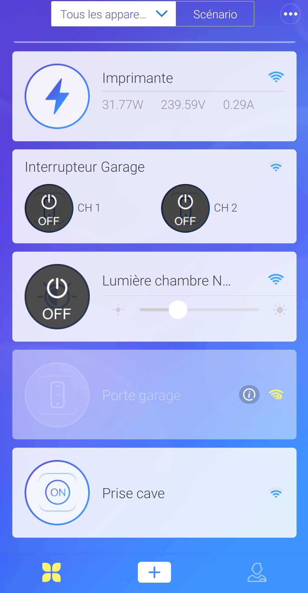

Selectionnez un de vos apareil

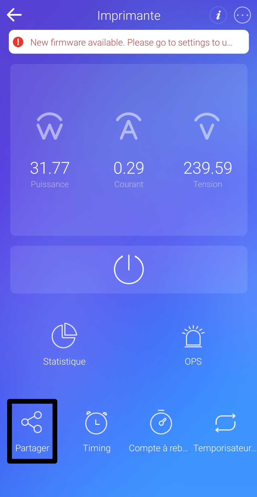

Cliquez sur partager

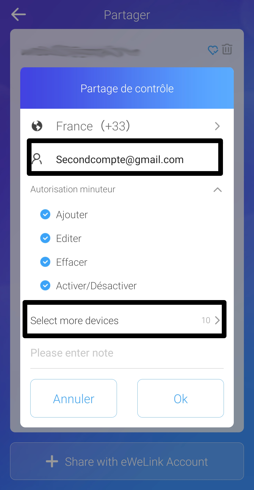

Entrez l'adresse mail du second compte eWeLink puis cliquez sur "Selectionner les devices".

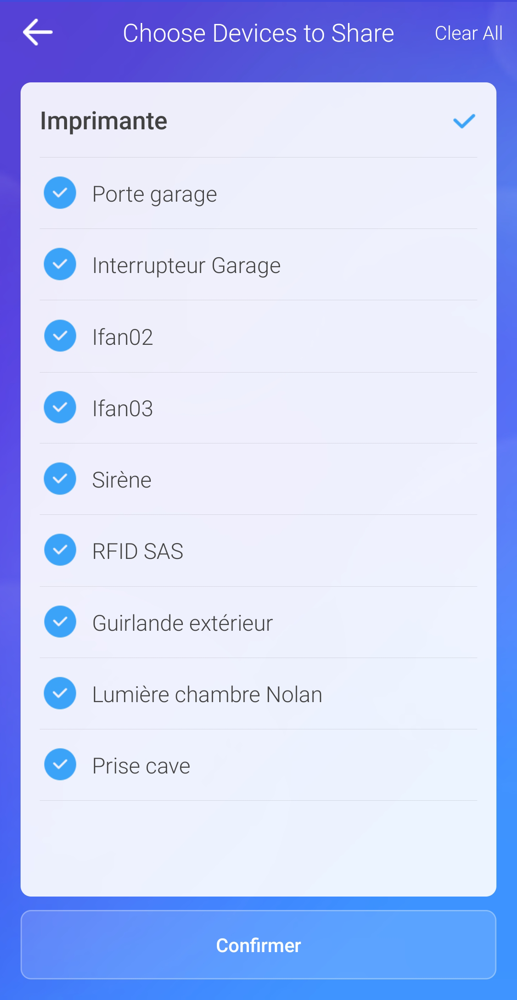

Cochez tous les équipements que vous souhaitez partager et confirmez 

Cliquez ensuite sur OK.

Sur le second apareil où vous avez eWeLink (le second compte), vous recevez une notifiction, acceptez la.

Et voila tous les apareils ont été partagé.

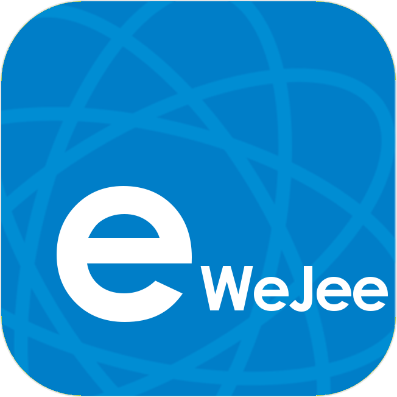 

 

Configuration 
------------- 

 

Configuration du plugin 
======================== 

 

a.  Installation/Création 

 

> **Tip** 

> 

> Afin d’utiliser le plugin, vous devez le télécharger, l’installer et 

> l’activer comme tout plugin Jeedom. 

 

Suite à cela vous arriverez sur cette page : 

 

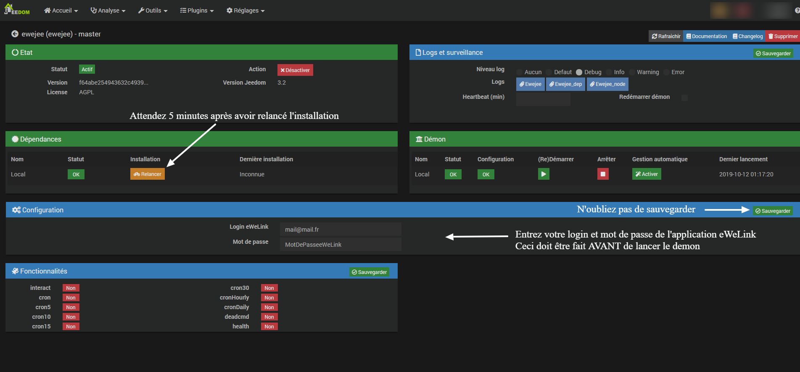 

 

Sur cette page vous devez entrez votre login et mot de passe de l’application eWeLink. 

Vous devez aussi choisir le type de connection, http ou https. 

Suivant le type de connection choisi, le plugin ira récupérer les informations dans la configuration de Jeedom, il est donc essentiel que ces informations sont correctes 

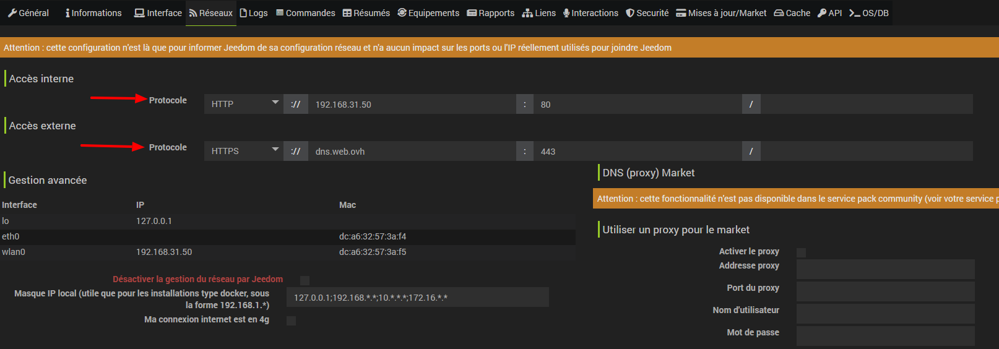 

N'oubliez pas de sauvgarder !
 

> **Important** 

> 

> Il faut impérativement attendre 5 minutes après avoir lancé l'installation des dépendances, vous pouvez suivre l’installation avec le log ewejee_dep. 

L’installation n'est pas très verbeux, il est donc normal que l'installation reste bloqué quelques instants à 60%. 

 

Si vous avez le message "Echec d'authentification, veillez vérifier vos identifiants" :  

 

- Le mot de passe ne peut pas contenir de signe "$". 

- Vérifiez vos identifiants, le login doit être l'adresse mail utilisé dans l’application eWeLink. 

- Si vos identifiants sont correct, vérifiez que le démon est bien lancé et que les dépendances sont "OK". 

- Regardez les log "eWeJee_node" dans la section "Logs et surveillance", les dernières lignes vous indique l’érreur, si vous ne la comprenez pas, contactez moi sur community ou GitHub. 

 

Si vous avez une erreur qui vous demande de vérifier le port, vérifiez la configuration dans l’onglet reseau, vérifiez l’accès interne et externe. 

 

Le plugin 
--------- 

 

Rendez vous dans le menu Plugins &gt; objets connectés pour retrouver le plugin. 

 

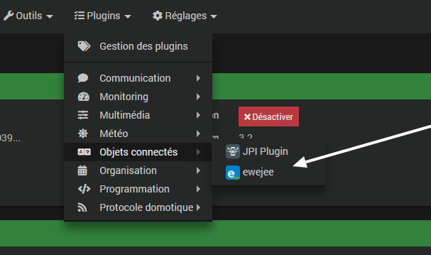 

 

Sur cette page, il vous suffit maintenant de cliquer sur le petit plus au-dessus de synchroniser pour synchroniser tous les équipements de l'application eWeLink. 

 

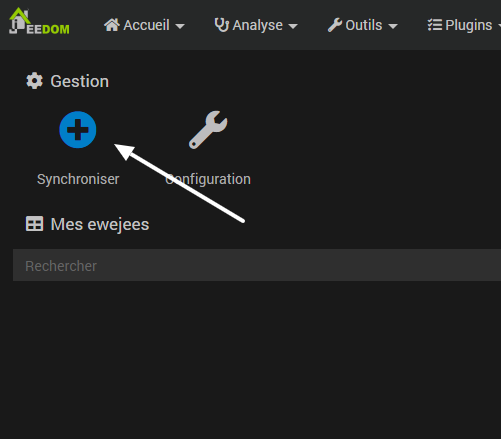 

 

Une fois que c'est fait si vous ne voyez pas les équipements, rechargez la page (CTRL + F5). 

 

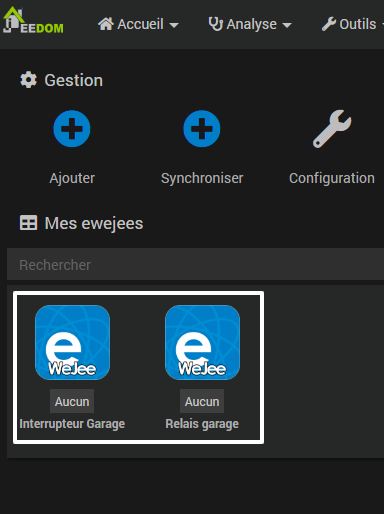 

 

Si vous ajoutez un nouvel appareil, il suffit de resynchroniser, et l’appareil sera également ajouté au plugin. 

 

Gestion 
========== 

 

Dans la partie gestion vous avez : 

-Synchroniser : Ce bouton sert à synchroniser tous les équipements de l'application eWeLink. 

> **Info** 

>  

>Une détection des équipements déjà connus à été ajouté, donc plus besoin de tout supprimer. 

>Si vous avez un équipement a actualiser, supprimer le. 

-Configuration : Pour voir la configuration du plugin… 

 

Mes ewejees 
============= 

 

Affiche tous vos équipements. 

1 ewejee correspond à un équipement (intérrupteur, prise etc…) 

 

Configuration d’un eWeJee 
============= 

 

Vous avez 2 onglets. 

 

Dans l’onglet équipement vous retrouver :  

 

- Le nom de l’équipement. 

- L'objet parent. 

- La catégorie. 

- Une case de commentaire. 

- La marque 

- Le modèle 

- L’état, s’il est en ligne ou non (Information actualisé quand une commande est lancée.) 

- La photo de l’équipement. 

 

 

 

> ** Info** 

> Vous pouvez modifier le nom cela n'a aucun impact. 

> La case de commentaire peut-être utilisé comme vous le souhaitez, cela vous permet de mettre un commentaire à votre équipement. 

 

 

Interrupteur / relais / prises 
=============================== 

Vous avez deux commandes action par « band » (Channel, canal) qui effectue un "on" et un "off" et une commande info qui vous indique s'il est allumé ou éteint. 

La commande info n’est pas binaire. 

 

- La mise a jour se fait automatiquement dès qu'un changement d'état est effectué (même en allumant un interrupteur sans passer par l'appli ou le plugin par exemple) 

- Pour les relais utilisé en "contact sec", l'état de change pas car celui-ci envoi un "push" sur le relai. 

 

> **Info** 

>  

> Il est normal de voir plusieurs channel et état même si votre equipement n'a qu'un channel, car dans la synchronisation  

> on récupère tous les paramètres et sonoff a 4 paramètres, et ceci même pour les équipements qui n'en ont qu'un seul. 

> Vous pouvez supprimer ceux qui sont en trop, sauf si le nom est "Ne pas suppr.", dans ce cas cet équipement est obligatoire pour le fonctionnement, vous pouvez décocher la case "Afficher" pour l'enlever du widget. 

 

Commandes  
========= 

 

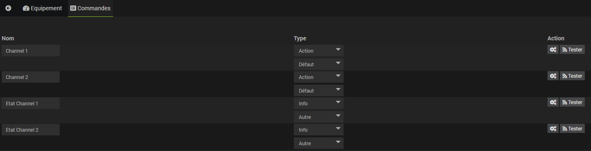 

 

- Nom : Le nom de ton équipement (Modifiable). 

- Type : Le type de commande. 

- Options : Permet d'afficher ou de cacher la commande, et d'historiser les commandes info. 

- Unitée : Permet de mettre une unitée (°C, %...). 

- Action : Accès à la configuration de la commande. 

 

Compatibilité 
------------- 

 

Le plugin est fait de façon a être compatible avec la majorité des équipements. 

Une adaptation doit être faites pour certains équipements, comme par exemple l'ifan, le POW, RF Bridge etc... 

 

Voici la liste des équipements compatible à 100% : 

 

Sonoff :  
========= 

 

- [x] ifan02/ifan03 

- [x] RF Bridge 

- [x] TH10/TH16 

- [x] Basic R2 

- [x] Basic R3 

- [x] Dual R2 

- [x] Mini 

- [x] POWR2 

- [x] 4CHR2/PROR2 

- [x] IW100/101 

- [x] TX SWITCH 

- [x] S20 

- [x] S26 

- [x] S31 

- [x] S55 

- [x] Relais DIY 

 

Si votre équipement n'est pas dans la liste, cela ne veut pas dire qu'il ne sera pas supporté par le plugin, cette liste est celle des équipements testé. 

 

Si vous remarquez qu'un de vos équipements n'est pas fonctionnel ou ne fonctionne pas correctement, vous pouvez me contacter sur le community de Jeedom (de préférence). 

Équipements spécifiques 

Sonoff POW 
==========

Le POW a une commande supplémentaire permettant de faire une remontée des informations de consommation, avec ce bouton, les informations seront remonté pendant 1 minute. 

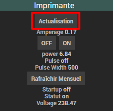 

Il dispose également d'un paramètre cron qui permet de faire l’actualisation a intervalle régulière ou en continu (1 minute) 

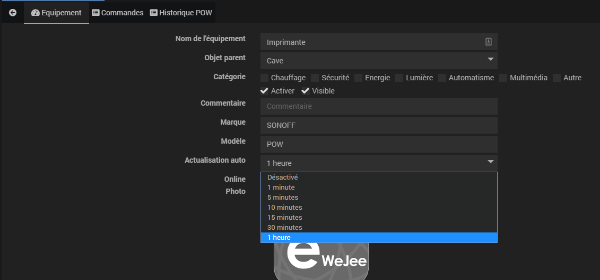 

Vous avez aussi une commande pour faire remonter les moyennes de consommation du mois en cours. 

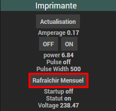  

Cette information est affiché sous forme de tableau dans l’onglet « Historique POW » 

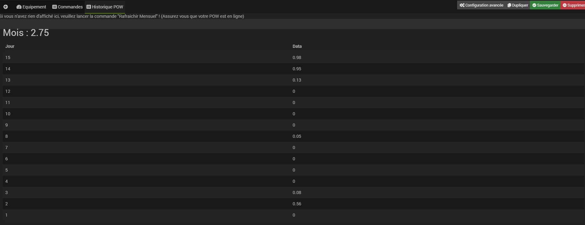  

Si vous avez des suggestions je serrais ravi de les lire ! 

Sonoff ifan 
===========

L'ifan est également spécifique, vous disposez de 4 commandes d'allumage et d'extinction et de 3 commandes pour les 3 vitesses. 

Il se peut que vous avez également des commandes info « ne pas suppr. ». 

Ces commandes sont essentiels pour le bon fonctionnement du plugin, il ne faut surtout pas les supprimer, en revanche vous pouvez les masquer du widget en décrochant la case « afficher ». 

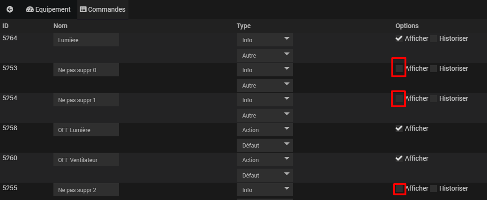  

Vous avez aussi des commandes info, une pour l’état de la lumière, l'autre pour donner la vitesse du ventilateur. 

 

Changelog 

========= 

 

Changelog détaillé : 

<https://github.com/foulek57/jeedom-ewejee/blob/master/docs/fr_FR/changelog.md> 